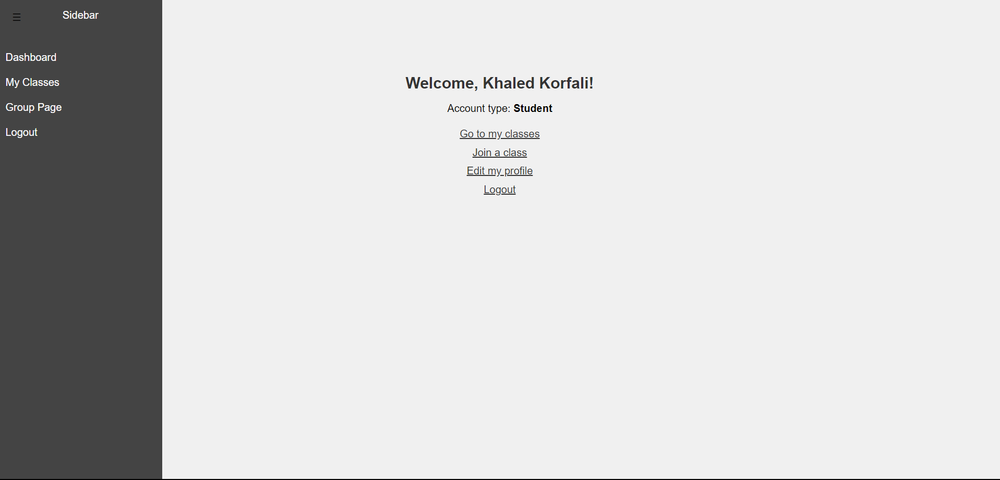
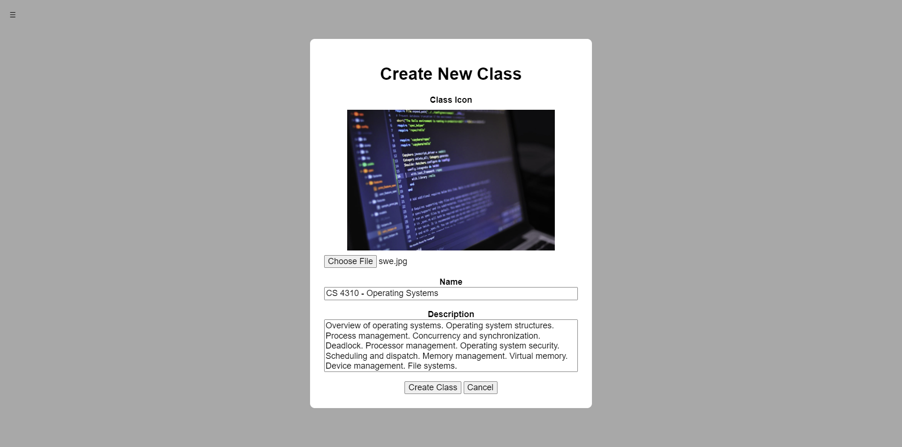
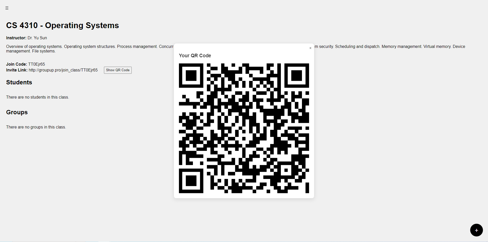
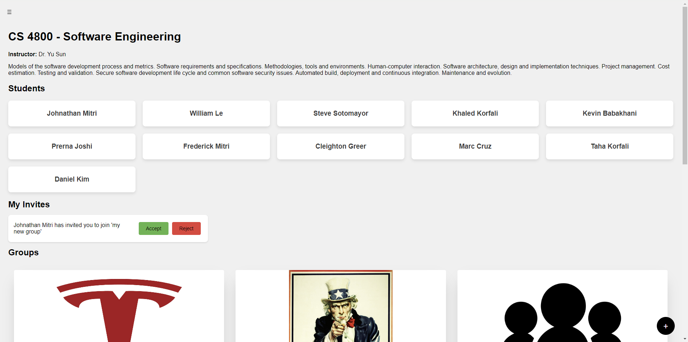
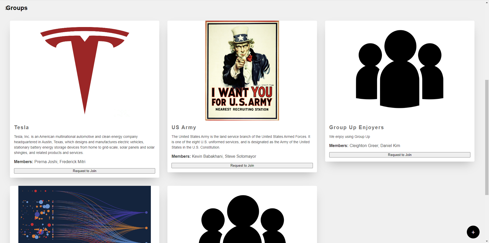
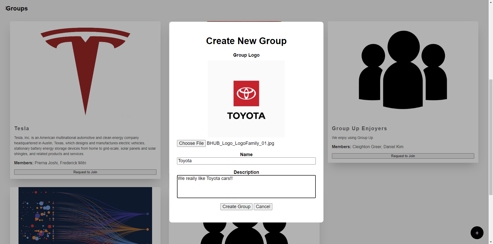

# GroupUp

Welcome to **GroupUp**, a platform designed to simplify group formation in school classes. GroupUp enables students to connect, form, and join study groups or project teams, enhancing collaboration and academic success.

## Features

- **Group Promotion**: Create and promote your own study or project groups, highlighting your group's focus and objectives.
- **Group Discovery**: Browse existing groups to find one that aligns with your interests and academic goals.
- **Direct Communication**: Contact group members directly to express interest and coordinate group activities.

## Usage

- **Creating a Group**:
  - Sign up or log in to your account.
  - Navigate to the "Create Group" section.
  - Fill in the group details, including name, description, and add a picture.
  - Submit the form to create your group.

- **Joining a Group**:
  - Browse the list of available groups.
  - Click on a group to view details and contact the group leader to join.

## Technologies Used

- **Frontend**:
  - JavaScript
  - HTML
  - CSS

- **Backend**:
  - PHP

- **Database**:
  - MySQL

- **Version Control**:
  - Git

## Screenshots

Below are screenshots illustrating the core features of GroupUp, reordered and updated for clarity and professionalism:

1. **Dashboard**

   

   *The Dashboard serves as the central hub for both teachers and students. Users can view their enrolled classes, join a class (for students), create a class (for teachers), or update their personal profile information.*

2. **Create Class**

   

   *The Create Class page allows instructors to establish new classes by entering details such as the class name, description, schedule, and additional relevant information.*

3. **Invite to Class**

   

   *The Invite to Class feature enables users to easily invite others to join a class. Invitations can be shared through a QR code or a unique join code.*

4. **Classes Overview**

   

   *The Classes Overview page provides a list of all classes in which the user is currently enrolled, allowing users to quickly navigate to their desired class homepage.*

5. **Class Homepage**

   

   *The Class Homepage offers an in-depth view of a specific class, including the class description, instructor details, associated groups, a list of students, and pending invitations. Users can create or join groups and manage their class activities directly from this page.*

6. **Group Details**

   

   *The Group Details section displays an overview of all groups within a class. Each group card includes a group image, name, current members, a description of its purpose, and an option to request to join.*

7. **Create Group**

   

   *The Create Group page allows users to form new groups within a class. Users can specify the group name, upload a group logo, and define the group’s objectives or personalized message.*

8. **User Profile**

   

   *The Profile page can be viewed by clicking on a student's name. It highlights a user's information, including their profile picture, bio, and options to invite them to a group or send a private message.*
 
